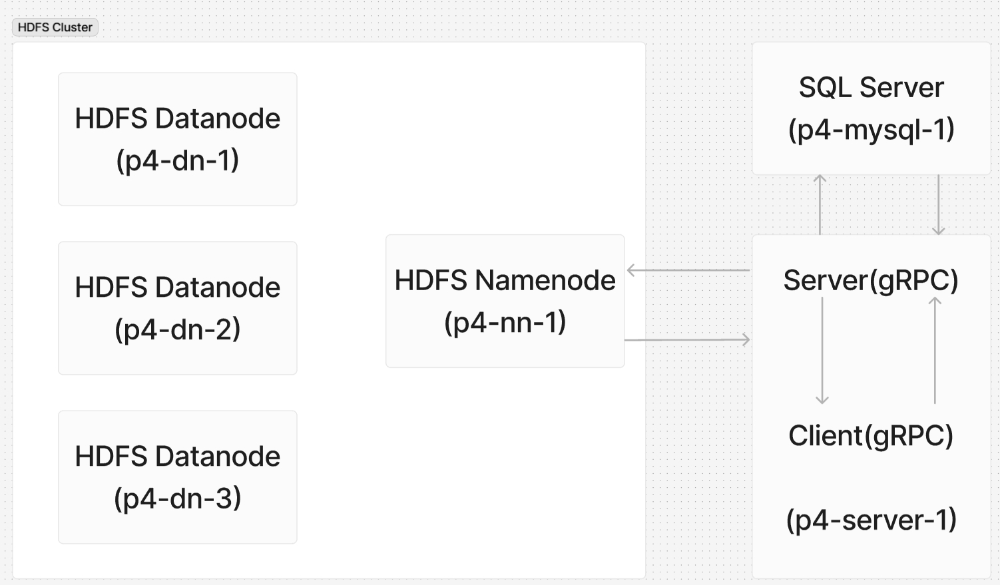
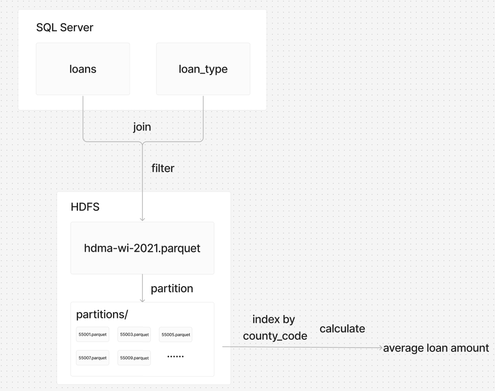

# P4 (3% of grade): SQL and HDFS

## Overview

In this project, you will depoly a data system consisting of an SQL server, an HDFS cluster, a gRPC server, and a client. You will need to read and filter data from a SQL database and persist it to HDFS. Additionally, you will write a fault-tolerant application that works even when an HDFS DataNode fails (we will test this scenario).

Learning objectives:
* communicate with the SQL Server using SQL queries
* use the WebHDFS API
* utilize PyArrow to interact with HDFS and process Parquet files
* handle data loss scenario
* read HDFS logs with the help of AI tools
* use AI to understand performance aspects of HDFS

Before starting, please review the [general project directions](../projects.md).

## AI Usage

For this project, you'll use Aider to generate code. Specifically, you are required to use `gemini-2.5-flash`.
You may use other AI tools to ask questions and learn. But for the code generation, you are restricted to Aider with the `gemini-2.5-flash` model.  

For prompt generation, organization and project summarization, it is expected that you do it manually.
You must run Aider with `--no-gitignore` and submit the Aider history files (`.aider.chat.history.md` and `.aider.input.history`).  Prompt sharing between students who are not partnerns is not allowed.

As usual, you will answer the questions in `ai.md` using your own words. You are allowed to copy/paste just the prompt if the question asks you to list the prompt. Do not copy/paste the output for the prompt.

## Corrections/Clarifications
* Oct 16: Changed the format of ai.md Q1
* Oct 16: Added more instructions on how to run files generated in part 3B.


## Introduction

You'll need to deploy a system including 6 docker containers like this:



The data flow roughly follows this:



We have provided the other components; what you only need is to complete the work within the gRPC server and its Dockerfile.
### Client
This project will use `docker exec` to run the client on the gRPC server's container. Usage of `client.py` is as follows:
```
#Inside the server container
python3 client.py DbToHdfs
python3 client.py BlockLocations -f <file_path>
python3 client.py CalcAvgLoan -c <county_code>
```

### Docker Compose

Take a look at the provided Docker compose file. There are several services, including 3 `datanodes`, a `namenode`, a `SQL server`, a `gRPC Server`. The NameNode service will serve at the host of `boss` within the docker compose network.

### gRPC

You are required to write a server.py and Dockerfile.server based on the provided proto file (you may not modify it).  

The gRPC interfaces have already been defined (see `lender.proto` for details). There are no constraints on the return values of `DbToHdfs`, so you may return what you think is helpful.

### Docker image naming
You need to build the Docker image following this naming convention.
```
docker build . -f Dockerfile.hdfs -t p4-hdfs
docker build . -f Dockerfile.namenode -t p4-nn
docker build . -f Dockerfile.datanode -t p4-dn
docker build . -f Dockerfile.mysql -t p4-mysql
docker build . -f Dockerfile.server -t p4-server
```
### PROJECT environment variable
Note that the compose file assumes there is a "PROJECT" environment
variable.  You can set it to p4 in your environment:

```
export PROJECT=p4
```

**Hint 1:** The command `docker logs <container-name> -f` might be very useful for troubleshooting. It allows you to view real-time output from a specific container.

**Hint 2:** Think about whether there is any .sh script that will help you quickly test code changes.  For example, you may want it to rebuild your Dockerfiles, cleanup an old Compose cluster, and deploy a new cluster.

**Hint 3:** If you're low on disk space, consider running `docker system prune --volumes -f`

## Part 1: `DbToHdfs` gRPC Call

In this part, your task is to implement the `DbToHdfs` gRPC call (you can find the interface definition in the proto file).

**DbToHdfs:** To be more specific, you need to:

1. Connect to the SQL server and use Aider to explore the tables in the database with name as `CS544` and the password as `abc`. 
2. What are the actual types for those loans? User Aider to explore the relevant columns to perform an inner join. 
3. Filter all rows where `loan_amount` is **greater than 30,000** and **less than 800,000**. After filtering, this table should have only **426716** rows.
4. Upload the generated table to `/hdma-wi-2021.parquet` in the HDFS, with **2x** replication and a **1-MB** block size, using PyArrow (https://arrow.apache.org/docs/python/generated/pyarrow.fs.HadoopFileSystem.html).

To check whether the upload was correct, use appropriate `docker` command to run bash on the gRPC server's container and use the appropriate HDFS command to see the file size. Feel free to use Aider to understand and explore the HDFS commands. The expected result should like:

```
14.4 M   28.9 M  hdfs://nn:9000/hdma-wi-2021.parquet
```

Is your filesize different from the one displayed above? Prompt Aider to ask for possible reasons for file size differences (even if your file size is not different). If the model's output does not give you details associated with compression, use further prompting to guide the model towards that. 

**Hint 1:** We used similar tables in lecture: https://git.doit.wisc.edu/cdis/cs/courses/cs544/f25/main/-/blob/main/meena_lec/17-sql/sql.ipynb?ref_type=heads 

**Hint 2:** A convenient way to run SQL queries would be to use `docker exec -it <container name> bash` to enter the SQL Server, then run mysql client `mysql -p CS544` to access the SQL Server and then perform queries.

**Hint 3:** After `docker compose up`, the SQL Server needs some time to load the data before it is ready. Therefore, you need to wait for a while, or preferably, add a retry mechanism for the SQL connection.

**Hint 4:** For PyArrow to be able to connect to HDFS, you'll need to configure some env variables carefully.  Look at how Dockerfile.namenode does this for the start CMD, and do the same in your own Dockerfile for your server.

## Part 2: `BlockLocations` gRPC Call

In this part, your task is to implement the `BlockLocations` gRPC call (you can find the interface definition in the proto file).

**BlockLocations:** To be more specific, for a given file path, you need to return a Python dictionary (that is, a `map` in proto), recording how many blocks are stored by each DataNode (key is the **DataNode location** and value is **number** of blocks on that node).

For example, running `docker exec -it p4-server-1 python3 /client.py BlockLocations -f /hdma-wi-2021.parquet` should show something like this:

```
{'7eb74ce67e75': 15, 'f7747b42d254': 7, '39750756065d': 8}
```

Note: DataNode location is the randomly generated container ID for the
container running the DataNode, so yours will be different, and the
distribution of blocks across different nodes will also likely vary.

The documents [here](https://hadoop.apache.org/docs/r3.3.6/hadoop-project-dist/hadoop-hdfs/WebHDFS.html) describe how we can interact with HDFS via web requests. Many [examples](https://requests.readthedocs.io/en/latest/user/quickstart/) show these web requests being made with the curl command, but you'll adapt those examples to use requests.get. By default, WebHDFS runs on port 9870. So use port 9870 instead of 9000 to access HDFS for this part.

Use a `GETFILEBLOCKLOCATIONS` operation to find the block locations.

**Hint:** You have to set appropriate environment variable `CLASSPATH` to access HDFS correctly. See example [here](https://git.doit.wisc.edu/cdis/cs/courses/cs544/f25/main/-/blob/main/meena_lec/19-hdfs/notebook.Dockerfile?ref_type=heads).          

#### Debug with AI 
If you encounter unexpected responses from the WebHDFS API, use Aider to analyze the error messages or JSON structure to understand what's happening.

## Part 3A: `CalcAvgLoan` gRPC Call


In this part, your task is to implement the `CalcAvgLoan` gRPC call (you can find the interface definition in the proto file).

The call should read hdma-wi-2021.parquet, filtering to rows with the specified county code.  One way to do this would be to pass a `("column", "=", ????)` tuple inside a `filters` list upon read: https://arrow.apache.org/docs/python/generated/pyarrow.parquet.read_table.html

The call should return the average loan amount from the filtered table as an integer (rounding down if necessary).

As an optimization, your code should also write the filtered data to a file named `partitions/<county_code>.parquet`.  If there are later calls for the same county_code, your code should use the smaller, county-specific Parquet file (instead of filtering the big Parquet file with all loan applications).  The county-specific Parquet file should have 1x replication.  When `CalcAvgLoan` returns the average, it should also use the "source" field to indicate whether the data came from big Parquet file (`source="create"` because a new county-specific file had to be created) or a county-specific file was previously created (`source="reuse"`).

One easy way to check if the county-specific file already exists is to just try reading it with PyArrow.  You should get an `FileNotFoundError` exception if it doesn't exist.

<!--
Imagine a scenario where there could be many queries differentiated by `county`, and one of them is to get the average loan amount for a county. In this case, it might be much more efficient to generate a set of 1x Parquet files filtered by county, and then read data from these partitioned, relatively much smaller tables for computation.

**CalcAvgLoan:** To be more specific, for a given `county_id` , you need to return a int value, indicating the average `loan_amount` of that county. **Note:** You are required to perform this calculation based on the partitioned parquet files generated by `FilterByCounty`. `source` field in proto file can ignored in this part.
-->

After a `DbToHdfs` call and a few `CalcAvgLoan` calls, your HDFS directory structure will look something like this:

      ```
      ├── hdma-wi-2021.parquet
      ├── partitions/
      │   ├── 55001.parquet
      │   ├── 55003.parquet
      │   └── ...
      ```

#### Debug with AI
When PyArrow operations fail:
- Capture full traceback: `import traceback; traceback.format_exc()`
- Use AI: "Analyze this PyArrow Parquet reading error and suggest fixes"


### Part 3B: `CalcAvgLoan` Performance Analysis & Plot Generation

Your task is to create a Python script, `performance_analyzer.py`, to measure and visualize the performance gain from your partitioning strategy. 

**1. Script Requirements**

Your script must perform the following actions automatically:
1.  Ensure a fair test by deleting the `/partitions` directory before starting.
2.  Loop through a list of the county codes ([55001, 55003, 55027, 55059, 55133]).
3.  Measure Execution Time: For each county:
    -   Time the first client call to get the "create" duration.
    -   Time the second client call to get the "reuse" duration.
4.  **Analyze and Plot:** Calculate the average "create" and "reuse" times. Generate a bar chart comparing these averages and save it as `performance_analysis.png`.

**2. Technical Guidance**
-   **Executing Commands:** Use Python's `subprocess` module to run `docker exec` commands from your script.
-   **Timing:** Use the `time.monotonic()` function from Python's `time` module to accurately measure the duration of each subprocess call. Do not use the shell's `time` command.
- After calculating your averages, create a DataFrame to store the values. The required format for `performance_results.csv` is:
    ```csv
    operation,time
    create,0.850
    reuse,0.620
    ```

**3. How to run**
- Create a Dockerfile.analyzer to build a container that can run your script.
- Build the analyzer image: `docker build -f Dockerfile.analyzer -t p4-analyzer .`
- Run the analyzer: The script saves its plot to an outputs directory inside the container.
```
docker run --rm \
  --network=p4_default \
  -v /var/run/docker.sock:/var/run/docker.sock \
  -v "$(pwd)/outputs:/app/outputs" \
  p4-analyzer
  ```

#### Understanding performance using AI
Use Aider to understand why partitioned data queries are faster and answer the relevant question in `ai.md`.

## Part 4: Fault Tolerance

A "fault" is something that goes wrong, like a hard disk failing or an entire DataNode crashing.  Fault tolerant code continues functioning for some kinds of faults.

In this part, your task is to make `CalcAvgLoan` tolerant to a single DataNode failure (we will kill one during testing!).

Recall that `CalcAvgLoan` sometimes uses small, county-specific Parquet files that have 1x replication, and sometimes it uses the big Parquet file (hdma-wi-2021.parquet) of all loan applications that uses 2x replication.  Your fault tolerance strategy should be as follows:

1. hdma-wi-2021.parquet: if you created this with 2x replication earlier, you don't need to do anything else here, because HDFS can automatically handle a single DataNode failure for you
2. partitions/<COUNTY_CODE>.parquet: this data only has 1x replication, so HDFS might lose it when the DataNode fails.  That's fine, because all the rows are still in the big Parquet file.  You should write code to detect this scenario and recreate the lost/corrupted county-specific file by reading the big file again with the county filter.  If you try to read an HDFS file with missing data using PyArrow, the client will retry for a while (perhaps 30 seconds or so), then raise an OSError exception, which you should catch and handle

CalcAvgLoan should now use the "source" field in the return value to indicate how the average was computed: "create" (from the big file, because a county-specific file didn't already exist), "recreate" (from the big file, because a county-specific file was corrupted/lost), or "reuse" (there was a valid county-specific file that was used).

**Hint:** to manually test DataNode failure, you should use `docker kill` to terminate a node and then wait until you confirm that the number of `live DataNodes` has decreased using the `hdfs dfsadmin -fs <hdfs_path> -report` command. 


To better understand how HDFS handles failures, you'll use AI to analyze system logs:

1. Post injecting a fault `docker kill p4-datanode-1`, collect the logs: `docker logs p4-namenode-1 > namenode_logs.txt`
2. Use Aider to answer:
   - How does the NameNode detect DataNode failures?
   - What log messages indicate blocks becoming under-replicated?
   - How long does HDFS take to mark a DataNode as dead?
   - What recovery mechanisms does HDFS attempt automatically?

3. Once you get all the answers from Aider, summarize them in your words for to answer the corresponding questions in `ai.md`. 

### Implementation Requirements

Your solution must:
- Catch `OSError` exceptions when reading county-specific Parquet files
- Fall back to reading from the big file when county files are unavailable due to DataNode failure
- Return the correct "source" value based on which data source was used
- Recreate the county-specific file when recovering from failure

**Testing your implementation:**
- Use `docker kill` to terminate a DataNode
- Wait until `hdfs dfsadmin -fs hdfs://nn:9000 -report` shows reduced live DataNodes
- Call `CalcAvgLoan` for counties whose files were affected
- Verify it returns `"recreate"` and successfully computes the average

**Hint**: The key insight is that county-specific files with 1x replication may become temporarily unavailable during DataNode failure, but the data still exists in the big 2x-replicated file. Your code should gracefully handle this temporary unavailability.

## Submission

Read the directions [here](../projects.md) about how to create the
repo.

You have some flexibility about how you write your code, but we must be able to run it like this:

```
docker build . -f Dockerfile.hdfs -t p4-hdfs
docker build . -f Dockerfile.namenode -t p4-nn
docker build . -f Dockerfile.datanode -t p4-dn
docker build . -f Dockerfile.mysql -t p4-mysql
docker build . -f Dockerfile.server -t p4-server
docker compose up -d
```

Then run the client like this:

```
docker exec p4-server-1 python3 /client.py DbToHdfs
docker exec p4-server-1 python3 /client.py BlockLocations -f /hdma-wi-2021.parquet
docker exec p4-server-1 python3 /client.py CalcAvgLoan -c 55001
```


Submit the following files in addition to the files provided:
```
performance_analyzer.py
performance_analysis.png
performance_results.csv
ai.md
server.py
Dockerfile.server
.aider.chat.history.md 
.aider.input.history
```

Note that we will copy in the the provided files (docker-compose.yml, client.py, lender.proto, hdma-wi-2021.sql.gz, etc.), overwriting anything you might have changed.  Please do NOT push hdma-wi-2021.sql.gz to your repo because it is large, and we want to keep the repos small.

Please make sure you have `client.py` copied into the p4-server image. We will run client.py in the p4-server-1 container to test your code. 

## Tester

This section will be updated once `autobadger` becomes available for this project.

See [projects.md](https://git.doit.wisc.edu/cdis/cs/courses/cs544/s25/main/-/blob/main/projects.md#testing) for more information.

